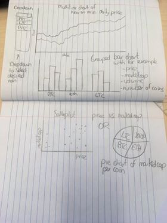

# programming_project

## Problem statement

Cryptocurrency is getting more and more popular these days. Many people do not know other coins besides the Bitcoin. With help of these visualizations, they get in touch with othere coins and some their characteristics. 

## Solution 

### Idea

The goal of this project, is to help people  get in touch with other coins. Furthermore, this project shows some statistics of the coins itself. For example, the marketcap, prices, volume etc. This in order to inform people about different coins.

### Sketches

### Main features

So far, the project will consist of a multiline graph, a grouped barchart and a scatterplot/piechart. It could be that the latter one will be substituted for another new visualization with different characteristics. Not sure about that for now. 

All visualizations will contain tooltips to view the specific number/amount of something. Furthermore, there will be a dropdown menu in which the user will be able to select the coin they want to view. 

An additional option could be to implement a 'on click' listener in de grouped bar chart as well. 

## Prerequisites

### data sources
data about coins with their characteristics:

https://coinmarketcap.com/
https://www.kaggle.com/sudalairajkumar/cryptocurrencypricehistory/data

In order to use this data, the data must be a little bit transformed with help of python. The idea is to create a json file which is very user friendly when using d3.

### External components

include libaries, this list can be expanded throughout the project:

d3-tip

### Similar visualization
As far as I know coinmarketcap.com comes close to what I have in mind. This website is easy in use and very clear for beginners. 
The aim is to be as clear as coinmarketcap.com and add a couple of features. Like a drop down menu in order to show the characteristics of the desired coin. There are not many visualizations on this site, so I can not get inspiration for all of my visualizations from this site. 

### Hardest part

For me the hardest past is to find data and transform it into the right form in order to create visualizations. Furthermore, finding new data about cryptocurrencies may be hard while crypto is relatively new for me and many people. 

