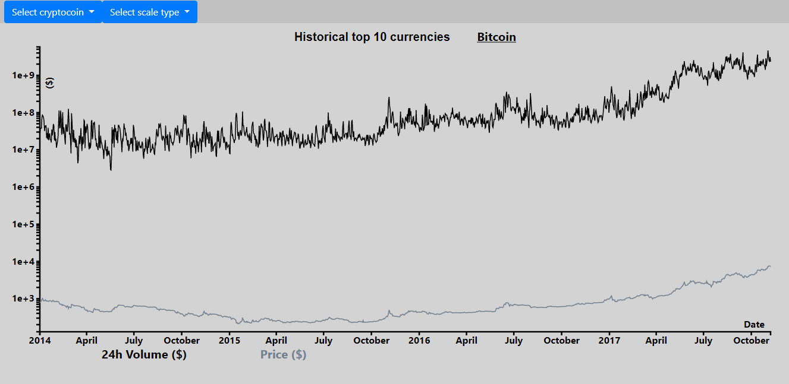
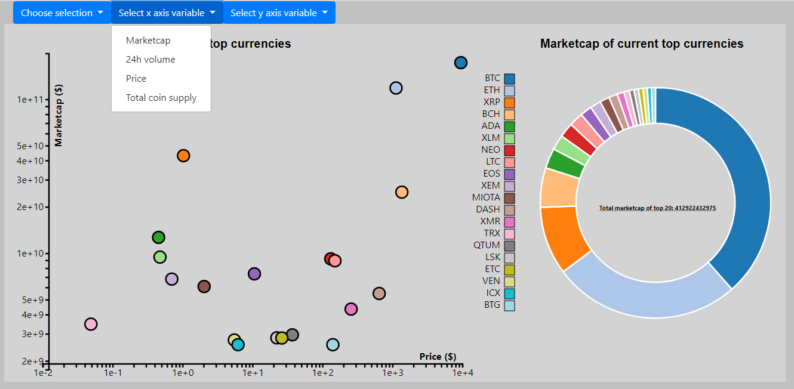

# Programming_project

https://jelledenhaan.github.io/programming_project/src/index.html

## Problem statement

Cryptocurrency is getting more and more popular. However, many people do not know any other crypto coins besides the Bitcoin. With this website, people can get in touch with some other popular crypto coins and their characteristics. The user will be able to view different kind of characteristics of crypto coins. Furthermore, the user is able to change the number of coins that will be shown. 

## Solution 

### Idea

The goal of this project, is to help people  get in touch with other coins. Furthermore, this project shows some statistics of the coins itself. For example, the marketcap, prices, volume etc. This in order to inform people about different coins. The linegraph will show historical data of the most popular cryptocoins of the past years. The scatterplot and donutchart will show data of the current top coins. An API request will make sure that the data of the scatterplot and donutchart is up to date. 

### Sketches

### Main features

The project consits of a multi linegraph, a scatterplot and a donutchart. 

The scatterplot and donutchart contains a tooltip. When the user hovers over the two charts, the characteristics of this coin will be showed. The linegraph however will not contain a tooltip. Because there are so many dates the tooltip would not work properly. For some coins, the data goes back to 2014. That means there are more than 1000 days to visualize and this is the reason that a tooltip would not work properly. Besides that, in my opinion a tooltip is not needed at all at the linegraph. This because the goal of the linegraph is to show the huge increase of volume and price that almost every coin has had in the past year. In my opinion it is not interesting to know the price of a specific date, however it is interesting to see the general trend of those coins. 

Furthermore, there is a dropdown menu in which the user will be able to select the coin they want to view in the linegraph. There is also another dropdown menu present, the user can select the desired axes variables and how many coins they would like to see in the scatterplot and donutchart. 

In order to give the user a insight in how much those coins have risen the past years, the user has an option to select a linear scale. When the users selects this scale only the priceline will be visible. This because it was impossible to show the volume and price in one graph with linear scale. In my opinion the price is more interesting to see so I decided to show only that line when the user selects a linear scale. Of course I could make a linegraph with 2 y axes but the time did not allow me to do so. Besides that, I don't know if a linear scale which shows the volume line will contribute much more to this page. When the user sees the price in the linear graph it is easy to conclude that the volume increased heavily as well. 

All the graphs are interactive. The user can also click on the dots in the scatterplot or on the pieces in the donutchart in order to view the historical data of that coin in the linegraph above. Note that not every coin in the scatterplot and donutchart has historical data. This because the linegraph uses static data from csv files and the scatterplot and donutchart uses data from a API request. This means that the top 20 coins in the scatterplot and donutchart could potentially be complete different than the historical top coins that are showed in the linechart.

## Prerequisites

### Data sources
data about coins with their characteristics:

https://coinmarketcap.com/

https://www.kaggle.com/sudalairajkumar/cryptocurrencypricehistory/data

In order to use this data, the data must be a little bit transformed with help of python. Therefore, I created a python file which tranforms the data from csv format to json format. D3.js and json format fit well to each other.

### External components

Libraries I used during this assignment:  

Bootstrap V4

Jquery

D3.js V3

D3.queue

### Similar visualization
As far as I know coinmarketcap.com comes close to what I have in mind. This website is easy in use and very clear for beginners. 
The aim is to be as clear as coinmarketcap.com and add a couple of features. Like a drop down menu in order to show the characteristics of the desired coin. There are not many visualizations on this site, so I can not get inspiration for all of my visualizations from this site. 

### Hardest part

For me the hardest past is to find data and transform it into the right form in order to create visualizations. Furthermore, finding new data about cryptocurrencies may be hard while crypto is relatively new for me and many people. It is also new for me to work with an API request. 

