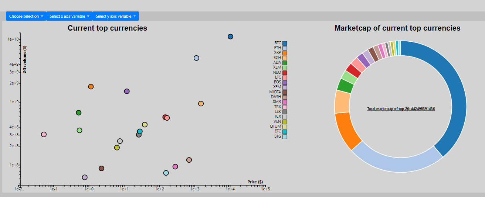

# Report Programming Project

## Short description of project
The website that has been made will help people get in touch with other cryptocurrency than Bitcoin. Historical data about the price and the 24h trading volume can be seen in the linegraph. In the scatterplot and Donutchart current data about different cryptocurrencies can be found. This data is derived from coinmarketcap.com. This in order to show the latest characteristics of those cryptocurrencies. The has the option to select different coins and can adjust the axes. 

## Design of the website 
The website contains 3 different visualisations to show data about cryptocurrency. In order to create those visualisation d3.js version 3 is used. The graphs should be interactive, therefore the data needs to be adjustable. I decided to split the functions which created the graphs. This means that there is an initialization function for each graph, and an update function for each graph. In the initialization functions all things that can be done without the data will be done. For example creating a SVG and setting the margins of the SVG. After the graph is initiliazed, the update function for the corresponding graph will be called and the default data will be shown in the graph. 

The data of the linegraph is extracted from several csv files. Whereas the data of the scatterplot and the donutchart is obtained using an API request. A jquery function is used to execute the API request. When the data is retrieved from the website, the data is stored in a global variable. This in order to access the data at every point. The data of the linegraph is loaded with help of the queue function. This function loads all the json files and awaits an initialization function. 

Since the graphs should be interactive, buttons are made on which the user can select multiple things. When the user clicks on a button the data which will be shown is changed and the update function of the corresponding graph will be called. For example, when the user wants to see the historical data of another coin. The user selects the desired coin and the update function of the line graph will be called. The same principle applies to the scatterplot and donutchart. The axes variables of the scatterplot can be changed, after that the update function of the scatterplot will be called. 

### more detailed design description
I decided to create many global variables, this in order to minimize the amount of arguments each function requires. Most global variables which represent the data are given a default value. This in order to create the default graphs when the page is loaded for the first time. When the user clicks on a button, the corresponding global variable will be changed and the update function of that graph will be called. Each button has a different name, this name is given to that global variable. By doing this the update function knows which data needs to be shown. For example the global variable for x axis of the scatterplot is called: "price_usd". When the user selects another variable for the x axis, the global variable will be changed and the update function knows which x axis variable needs to be shown. Furthermore, the SVG's are placed in Bootstrap containers. This in order to make sure that the website has the right structure and looks properly.  

There is also a python file which transforms the data of the linegraph from csv format to json format. This because json format is easy in use when using d3.js. 

So in short, each button contains a name which changes the graph by calling an update function of that specific graph. This update function updates the graph with the right data which is changed by clicking on a button of the dropdown-menu's.

## Challenges

There were quite a lot of challenges during this project. First of all, I had never worked with an API request. It was a little bit difficult to get the data from the website, luckily that data was already in json format which was easy to work with. On the other side, the data that I got from kaggle was not so easy to work with. I needed to write a python script to manipulate and transform the data into json format. Making sure that all the graphs were interactive and that there was a way to update them was also very difficult at the beginning. For me personally it was hard to determine the pieces of code that needed to be in the initialize function and which pieces needed to be in the update function. In previous assignments I had not as many functions as in this project, so making sure that everything was in the right order and at the right place in the code was also challenging. It was also challenging to update the graphs when the users clicks on a button from the dropdown menus. I decided to give every button a special name and when the user clicks on the buttons, the global variable changes into that name in order to update the graph with the right data.

### Defending the changes
Just like in any other project, the final result differs a bit from the project plan. In this project it isn't any different. At first I thought I would make 4 charts, and at the end I decided to skip the grouped barchart. This had two reasons, firstly because we had only 4 weeks to complete this project. Since I am not a master programmer I decided to only focus on the 3 graphs that are now present on the website. 

Second, I decided not to make a tooltip for the linegraph. Because there are so many dates the tooltip would not work properly. For some coins, the data goes back to 2014. That means there are more than 1000 days to visualize and this is the reason that a tooltip would not work properly. Besides that, in my opinion a tooltip is not needed at all at the linegraph. This because the goal of the linegraph is to show the huge increase of volume and price that almost every coin has had in the past year. In my opinion it is not interesting to know the price of a specific date, however it is interesting to see the general trend of those coins. This made me decide that it is not needed to create a tooltip for the linegraph. If the users would like to see the current characteristics of the coins they could look at the scatterplot and donutchart. Both graphs have tooltips if the user hovers over the dots or pieces in the donutchart. The current characteristics are much more interesting than historical data of a specific day. In order to give the user a insight in how much those coins have risen the past years I decided to give the user an option to select a linear scale. When the users selects this scale only the priceline will be visible. This because it was impossible to show the volume and price in one graph with linear scale. In my opinion the price is more interesting to see so I decided to show only that line when the user selects a linear scale. Of course I could make a linegraph with 2 y axes but the time did not allow me to do so. Besides that, I don't know if a linear scale which shows the volume line will contribute much more to this page. When the user sees the price in the linear graph it is easy to conclude that the volume increased heavily as well. 

Furthermore, I decided to create a line for the price and a line for the volume in the linegraph. At the beginning of this project I wanted to show the user the highest and the lowest price of the day. However, during this project I came to the conclusion that this was not clever to do. The lines were to close to each other and it was impossible to separate the lines. This made me decide to create one line that represents the volume and one line that represents the price. 